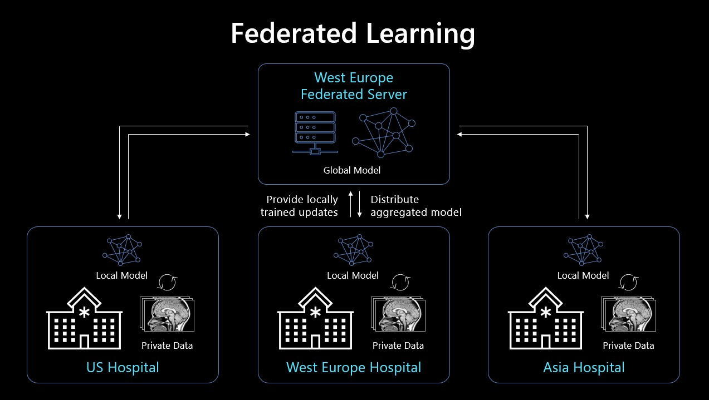

# NVFlare on Azure

The Federated Learning paradigm gained a lot of interest in the healthcare community, because it enables model training on all available data, without sharing data between insitutions. 
NVIDIA Flare is a domain-agnostic, open-source and extensible SDK for federated learning. This walkthrough descibes how NVIDIA Flare can be run on Azure.

The way this demo is implemented, is that a federated server is hosted on an Azure VM. 
Three Azure Machine Learning Workspaces in different regions are used to simulate different clients (e.g. hospital sites) that train a local model on their private dataset.
The local models will be aggregated on the federated server, using federated averaging. This means that initial weights are distributed to the clients, who perform local training.
After local training, clients return their local weights to the federated server, which then aggregates these weights (averaged). This new set of global average weights is redistributed to clients and the process repeats for the specified number of rounds.

An overview of the architecture can be found below:



## 1. Prepare your experiment
- Fork this repo
- Create a resource group for the different resources, by using the following command in the Azure Cloud Shell or using the Azure Portal:
```
az group create -n fedlearn
```

- Create a service principal, using the Cloud Shell in the Azure portal, which has contributor access to your resource group

```
  az ad sp create-for-rbac --name "<service-principal-name>" --role contributor \
                              --scopes /subscriptions/<subscription-id>/resourceGroups/<your-resource-group-name> \
                              --sdk-auth
```
- Create a GitHub secret in your repository. Name it AZURE_CREDENTIALS and copy and paste the output of the service principal to the Value field of the secret.

- Create another secret in your repository, with the name VM_PASSWORD. As a value, enter the password you would like to use for accessing the VM.

- Navigate to the GitHub Actions tab, and run the workflow with the name *FL provision resources*. If your resource group has a different name then 'fedlearn', change the name of the workflow variable accordingly. This will create a VM, 3 Machine Learning Workspaces and Compute Instances to your resource group.

- Run the GitHub Actions workflow with the name *FL data preperation*. This will register the datasets required for your experiment in your workspace.

## 3. Setup federated server
In this step, we will login to the VM and setup the federated server.

- Connect to the VM via SSH by using the following command in the Windows Terminal (bash) `ssh <vm-username>@<vm-public-ip>` and fill in the VM password.
- Clone this repo to the VM and navigate to it.
- Install NVFlare library via pip: `pip install nvflare`
- Add the DNS name that is configured for the virtual machine to `project.yml`
- Run provision script:
```
provision -p project.yml
```
- Create two new folders on VM in home dir: fedserver and fedadmin
- Copy server and admin packages to these folders
- Run start script in fedserver folder
- Run the following command to open the host file or your VM: `sudo vi /etc/hosts`
- Press *i* to start insering content in your host file
- Create a new entry on line 2 using this pattern: `<private-ip-of-vm> <dns-address>` (the private IP address of your VM can be found by accessing your VM in the Azure portal and in the Overview, look for Networking -> Private IP address)


## 4. Prepare clients
As mentioned, the clients will be implemented through different Azure Machine Learning Workspaces in different regions. In this step, we are creating the workspaces and create Compute Instances within it. 
The Compute Instances will be configured as a client and initiate communication with the federated server.

For every client, repeat the following steps:
- Access the workspace via the Azure Machine Learning Studio on https://ml.azure.com.
- Access the Compute Instance that was created in the workspace by open up a terminal that is connected to it on the *Notebooks*-page of the workspace.
- Using the terminal, install NVFlare library via pip: `pip install nvflare`
- Copy one of the site packages that is generated on the federated server to the filesystem connected to your Machine Learning Workspace. One approach for this is to go to Notebooks in the Azure Machine Learning Studio, click on the *plus*-icon, and select *Upload folder*.
- Using the terminal, Navigate to the startup folder of the client package that you uploaded, and run the start script using the following command: `bash ./start.sh`.

## 5. Run the experiment
In this step, we use the admin client of our federated application to upload the training code to the different clients and start the training run.

- Open a new SSH connection to your federated server.
- Log into the Admin client on federated server, by navigating to the admin folder (where you copied the admin package) and running the start script.
- The admin client will prompt for a username and password. By default, both are *admin@nvidia.com*.
- Use the admin commands one by one to run the experiment:

```
set_run_number 1
upload_app pneumonia-federated
deploy_app pneumonia-federated
start_app all
```
- For more information on the different command, type *help* or *?* to the admin client, or read more on [this](https://nvidia.github.io/NVFlare/user_guide/admin_commands.html) page.

## 6. Access training metrics via TensorBoard
On the federated clients, training metrics are streamed to the server that can be accessed from Tensorboard. The federated server also stores metrics from the global model as TensorBoard events.

- To run TensorBoard on the federated server, use the following command: `tensorboard --logdir=workspace/server/run_1/tb_events`
- By default, TensorBoard is running on port 6006. To make this port accessible, open port 6006 on the VM for your client IP specifically.
- In your browser, nagivate to: `https://<dns-label-of-your-vm>:6006`.

## 6. Clean up resources

- Delete your resource group by using the following command: `az group delete -g <resource-group-name>`.
